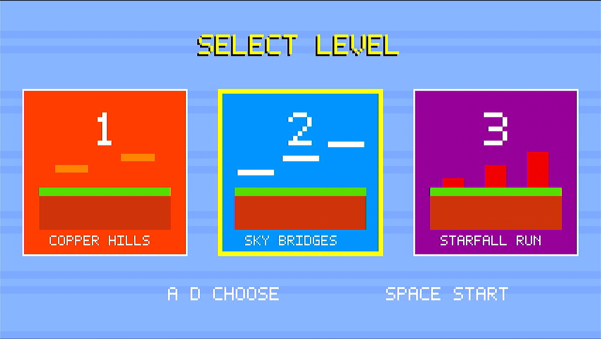
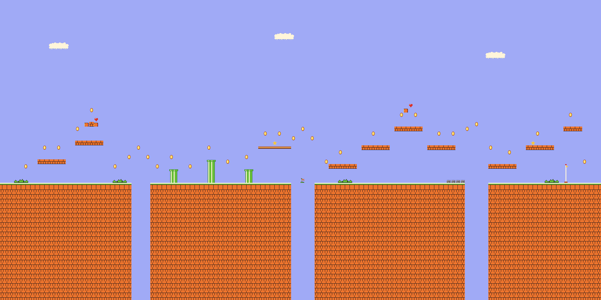
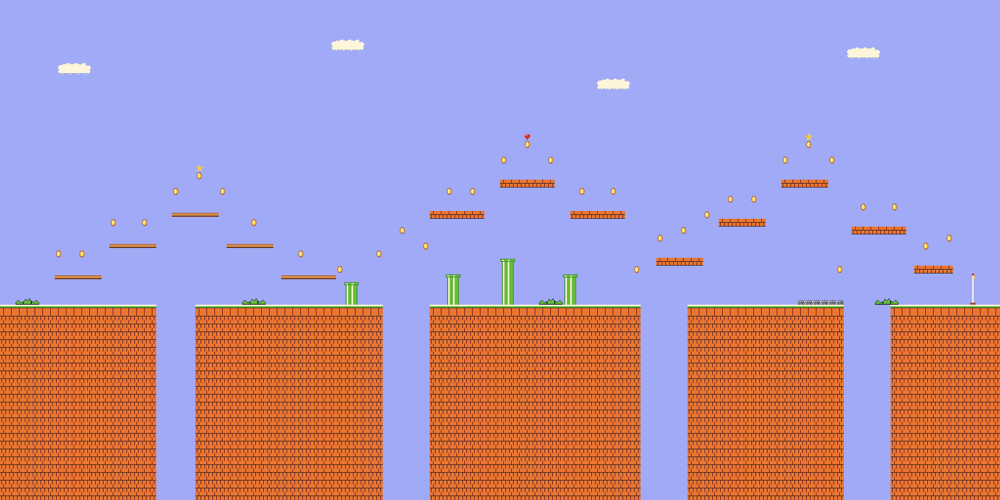
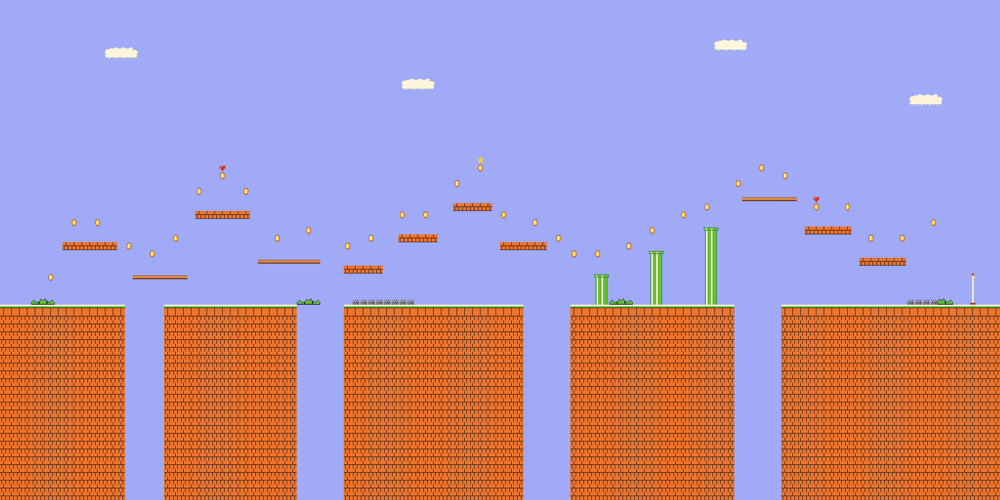

# Super Mario FPGA

## Project overview

This project implements a 1280x720 2D platform game on a Xilinx Artix-7
FPGA. Handwritten SystemVerilog provides the tile/sprite renderer, AXI4-Stream
video path, clock-domain crossing FIFO, video timing, TMDS encoding, and board
bring-up logic. A MicroBlaze application handles gameplay, SD-card asset
loading, UART keyboard input, and AXI VDMA frame-buffer control.

The design uses a DDR3 frame-buffer architecture: the sprite engine renders
RGB565 frames into DDR3 through AXI VDMA S2MM, while VDMA MM2S reads a completed
frame through an asynchronous FIFO to the HDMI transmitter.

## Hardware platform

| Item | Configuration |
|---|---|
| Board | ALIENTEK DaVinci Pro, CF7A100B |
| FPGA | Xilinx Artix-7 `XC7A100T-2FGG484` |
| Board clock | 50 MHz |
| DDR3 | 512 MiB, 32-bit interface, 400 MHz clock / 800 MT/s |
| Video | HDMI_B output, 1280x720p60, RGB565 internal format |
| Input | PC keyboard state over USB-UART, 115200 baud, 8N1 |
| Storage | SD card in SPI mode with a read-only FatFs adapter |
| Debug | JTAG, UART diagnostics, four status LEDs, optional ILA |

Nominal internal clocks are 100 MHz for the MIG AXI UI, 74.25 MHz for pixels,
and 371.25 MHz for 10:1 DDR TMDS serialization. The standalone color-bar build
uses a Vivado-derived 74.21875 MHz pixel clock, a -0.042% timing approximation.

### Hardware Board

The design is developed and tested on the ALIENTEK DaVinci Pro CF7A100B board.

<p align="center">
  
</p>

## Architecture

<p align="center">
  
</p>

The SD card supplies maps, collision data, tiles, sprites, and the RGB565
palette. Assets are staged in DDR3 and uploaded to renderer-local memories.
Three 2 MiB-aligned frame stores at `0x8C00_0000`, `0x8C20_0000`, and
`0x8C40_0000` isolate rendering from display scanning and support frame-safe
buffer selection.

For the complete dataflow, clock domains, and start-up sequence, see
[Architecture](docs/architecture.md).

## Gameplay screens and maps

At boot, the MicroBlaze application draws a three-card level selector into a
DDR framebuffer while the SD card and game assets are verified. Use A/D to
choose a level and Space to start it.

Gameplay demonstration: [watch the FPGA Super Mario video on YouTube](https://youtu.be/wigF1Zxwkow).

<p align="center">
  
</p>

The repository includes three generated 128x64-tile maps. Each preview shows a
2048x1024-pixel world rendered from the same tile and collision data used by the
FPGA game:

<table border="0" cellpadding="12" cellspacing="14">
  <tr>
    <td align="center" style="border: 2px solid #888; padding: 8px; vertical-align: top;">
      <strong>Copper Hills</strong><br><br>
      
    </td>
    <td align="center" style="border: 2px solid #888; padding: 8px; vertical-align: top;">
      <strong>Sky Bridges</strong><br><br>
      
    </td>
    <td align="center" style="border: 2px solid #888; padding: 8px; vertical-align: top;">
      <strong>Starfall Run</strong><br><br>
      
    </td>
  </tr>
</table>

## Main modules

- **HDMI controller** — `hdmi_720p` combines 720p timing, RGB565 expansion,
  blanking/control symbols, three TMDS channels, and differential outputs.
- **TMDS encoder and serializer** — `hdmi_tmds_encoder` maintains running
  disparity; `hdmi_tmds_serializer` maps each 10-bit symbol to Artix-7
  `OSERDESE2` resources.
- **Pixel generator** — `hdmi_timing_720p` generates 1650x750 raster timing and
  fixed-latency pixel requests. `hdmi_rgb565_source` also supplies diagnostic
  color bars, solid color, and checkerboard patterns.
- **Sprite engine** — `sprite_engine` composites a scrolling 128x64 tile map
  and up to sixteen 32x32 sprites into one RGB565 pixel per accepted clock.
  Ready/valid backpressure stalls the pipeline without losing coordinates.
- **Frame-stream adapter** — `sprite_frame_stream` emits active pixels with
  AXI4-Stream Video `TUSER` start-of-frame and `TLAST` end-of-line markers.
- **DDR3 interface** — Xilinx MIG provides the physical controller and a
  256-bit AXI port. The handwritten `ddr3_axi_selftest_top` performs repeated
  32 KiB AXI write/read/compare tests after calibration.
- **Frame-buffer bridge** — `hdmi_vdma_fifo_bridge` validates VDMA framing,
  applies FIFO backpressure, and crosses pixels into the HDMI clock domain.
- **Game controller** — gameplay is currently a MicroBlaze software update
  loop, not a standalone RTL game FSM. Movement, collision, enemies, level
  state, animation, and camera updates are synchronized to completed frames.
- **UART interface** — AXI UART Lite receives a compact key-state byte from
  [keyboard_uart.py](scripts/host/keyboard_uart.py).
- **SD interface** — AXI Quad SPI plus the custom read-only driver in
  [software/sd_spi](software/sd_spi) loads FAT32 game assets.

Detailed ports, responsibilities, and implementation ownership are listed in
[Module descriptions](docs/module_description.md).

## Design highlights

- Handwritten, stall-safe RTL rendering and AXI4-Stream framing.
- Explicit finite-state machines for DDR3 self-test, renderer initialization,
  asset unpacking, and frame generation.
- Native 720p video with a DVI-compatible TMDS transmitter built from Artix-7
  primitives rather than a packaged video-output subsystem.
- Multiple intentional clock domains, including MIG UI/AXI, SPI control,
  pixel, and phase-related 5x serialization clocks.
- `xpm_fifo_async` for the variable-latency VDMA-to-fixed-rate HDMI boundary.
- DDR3 triple buffering and frame-boundary switching to prevent tearing.
- Renderer-local indexed-color memories that decouple active-pixel timing from
  SD-card and DDR3 latency.
- Incremental board validation targets for HDMI, DDR3, and the full
  framebuffer path.

## Repository layout

```text
.
├── rtl/                 Handwritten synthesizable SystemVerilog
│   ├── top/             Board tops and deterministic bring-up pattern
│   ├── hdmi/            HDMI controller, TMDS encoder, serializer
│   ├── video/           Timing, RGB source, VDMA/FIFO bridge
│   ├── sprite/          Renderer, AXI-Lite control, asset unpacker
│   └── memory/          Dual-clock pixel FIFO
├── constraints/         Board and target-specific XDC files
├── simulation/          Handwritten SystemVerilog testbenches
├── software/            MicroBlaze applications, drivers, and host-test stubs
├── scripts/             Host-UART and Vivado automation
├── vivado/              Vivado project, block design, XCI, and MIG config
├── assets/              Source art, generated renderer data, and SD image tree
└── docs/                Architecture, interfaces, and bring-up
```

The checked-in `.xpr`, `.bd`, `.xci`, and MIG `.prj` files are configuration
sources required to recreate the vendor IP. Generated HDL, checkpoints, run
directories, logs, bitstreams, reports, hardware captures, and simulator
databases are intentionally excluded.

## Build and simulation

The project was authored with Vivado/Vitis 2025.2. Open
`vivado/Super_Mario.xpr`, or run the staged targets from the repository root:

```bash
# Standalone HDMI color bars
vivado -mode batch -source scripts/vivado/create_hdmi_colorbar_test.tcl
vivado -mode batch -source scripts/vivado/build_hdmi_colorbar_test.tcl

# Standalone DDR3 AXI self-test
vivado -mode batch -source scripts/vivado/create_cf7a100b_mig.tcl
vivado -mode batch -source scripts/vivado/create_ddr3_selftest.tcl
vivado -mode batch -source scripts/vivado/build_ddr3_selftest.tcl

# Integrated MicroBlaze + renderer + framebuffer + HDMI target
vivado -mode batch -source scripts/vivado/create_framebuffer_black_bd.tcl
vivado -mode batch -source scripts/vivado/create_framebuffer_black_target.tcl
vivado -mode batch -source scripts/vivado/validate_project.tcl
vivado -mode batch -source scripts/vivado/build_framebuffer_black.tcl
vitis -s software/super_mario_game/build.py
vivado -mode batch -source scripts/vivado/embed_framebuffer_black_elf.tcl
```

Vivado and Vitis write all reproducible output beneath ignored `build/` and
`vivado/Super_Mario.*` generated directories.

Run the portable RTL, host-side C, and Python checks with:

```bash
scripts/run_tests.sh
```

The two core RTL tests can also be invoked directly with Icarus Verilog:

```bash
iverilog -g2012 -s tb_sprite_frame_stream \
  -o /tmp/tb_sprite_frame_stream \
  rtl/sprite/sprite_frame_stream.sv \
  simulation/sprite/tb_sprite_frame_stream.sv
vvp /tmp/tb_sprite_frame_stream

iverilog -g2012 -s tb_sprite_asset_unpacker \
  -o /tmp/tb_sprite_asset_unpacker \
  rtl/sprite/sprite_asset_unpacker.sv \
  simulation/sprite/tb_sprite_asset_unpacker.sv
vvp /tmp/tb_sprite_asset_unpacker
```

The repository includes pre-generated game assets under `assets/`. The binary
files in `assets/sdcard/GAME/` are ready to copy to the SD card; no Python or
Pillow installation is required for the FPGA build or runtime.

## Verification status

A clean temporary checkout was recreated with Vivado 2025.2. MIG, the DDR3
self-test target, the HDMI target, and the integrated MicroBlaze/framebuffer
block design all validated. Both the HDMI reference and integrated hardware
targets completed synthesis, implementation, timing, DRC, and bitstream
generation. Integrated timing closed at WNS +0.848 ns and WHS +0.014 ns; the
bitstream DRC had zero errors.

The portable RTL/C/Python test suite passes. The Vitis game application was not
rebuilt or embedded during this cleanup, so that step and the on-board hardware
checklist should still be rerun for a tagged release. See the
[Bring-up guide](docs/bringup.md) for LED/UART expectations.

## Documentation

- [Documentation index](docs/README.md)
- [Architecture](docs/architecture.md)
- [Module descriptions](docs/module_description.md)
- [Hardware interfaces](docs/hardware_interfaces.md)
- [Board bring-up guide](docs/bringup.md)
