# Architecture

## System partitioning

The design deliberately separates deterministic, cycle-sensitive video work
from control-heavy game logic:

- SystemVerilog renders pixels, transports complete frames, crosses clock
  domains, and drives TMDS.
- MicroBlaze software loads assets, updates the game model, and configures
  DMA/VDMA peripherals.
- Xilinx IP supplies DDR3 PHY/controller, AXI interconnect, processor,
  clocking, UART, SPI, VDMA, debug, and reset infrastructure.

```mermaid
flowchart LR
    PC[PC keyboard] -->|UART key mask| UART[AXI UART Lite]
    SD[SD card / FAT32] -->|SPI| SPI[AXI Quad SPI]
    UART --> MB[MicroBlaze game controller]
    SPI --> MB
    MB -->|packed frame state via AXI GPIO| CTRL[Renderer control]
    MB -->|asset commands via AXI GPIO| UNPACK[Asset loader]
    UNPACK --> LOCAL[Tile, sprite, map and palette memories]
    CTRL --> RENDER[Sprite engine]
    LOCAL --> RENDER
    RENDER --> STREAM[AXI4-Stream frame source]
    STREAM --> S2MM[VDMA S2MM]
    S2MM --> DDR[(DDR3 triple buffers)]
    DDR --> MM2S[VDMA MM2S]
    MM2S --> FIFO[Asynchronous pixel FIFO]
    FIFO --> VIDEO[720p timing and RGB conversion]
    VIDEO --> TMDS[TMDS encoders and serializers]
    TMDS --> HDMI[HDMI_B output]
```

## Render path

`sprite_frame_stream` requests coordinates in raster order. `sprite_engine`
adds camera scroll, looks up the tile map and tile graphic, evaluates all
enabled sprite slots, resolves transparency/priority, and maps the winning
four-bit palette index to RGB565. A shared ready/valid stall condition freezes
every renderer stage, so VDMA backpressure cannot separate a pixel from its
coordinate.

The output stream contains active video only. `TUSER` marks `(0,0)` and
`TLAST` marks pixel 1279 of each line. VDMA S2MM writes 720 lines of 2560 bytes
to a frame store.

## Frame-buffer architecture

Each 1280x720 RGB565 frame occupies 1,843,200 bytes. Three 2 MiB-aligned
regions are reserved:

| Store | Base address | Role |
|---|---:|---|
| 0 | `0x8C00_0000` | Display/render rotation |
| 1 | `0x8C20_0000` | Display/render rotation |
| 2 | `0x8C40_0000` | Display/render rotation |

The integrated target configures VDMA with dynamic genlock and frame stores so
MM2S consumes a completed frame while S2MM produces another. CPU-rendered
level-selection screens use three additional stores beginning at
`0x8C60_0000`.

The production MicroBlaze application reads maps and graphics from SD and
writes them through the renderer's AXI-GPIO command interface into local
memories. The alternative AXI-Lite/DMA software under `software/mario_game`
is not connected to the checked-in block design. Active-pixel rendering never
waits directly on MIG or SD-card latency.

## Clock and reset domains

| Domain | Nominal rate | Responsibilities |
|---|---:|---|
| Board/system | 50 MHz | Input reference, reset entry point |
| MIG UI / AXI | 100 MHz | MicroBlaze, DDR-side AXI, VDMA memory interfaces |
| SPI AXI | 6.25 MHz | AXI Quad SPI control path |
| Pixel | 74.25 MHz | Sprite renderer, S2MM stream, timing, TMDS encoding |
| Pixel 5x | 371.25 MHz | OSERDESE2 DDR serialization |

Clock-domain crossings are explicit:

- VDMA MM2S/UI to pixel: `xpm_fifo_async` in `hdmi_pixel_fifo`.
- Renderer-control GPIO to pixel: synchronized and committed at a render-frame
  boundary in the integrated top.
- Pixel to TMDS 5x: phase-related clocks from the same Clocking Wizard/MMCM,
  consumed by OSERDESE2 `CLKDIV` and `CLK`.
- The reusable but currently unintegrated AXI-Lite control path provides an
  asynchronous command FIFO in `sprite_engine_axi_lite`.

The FIFO reset and HDMI reset are intentionally separate. The FIFO must be
released and prefetched before the timing generator is released; otherwise
the first active scan would underflow.

## Start-up sequence

1. Buffer the 50 MHz input and generate the 200 MHz IODELAY reference.
2. Release MIG and wait for `init_calib_complete`.
3. Release the MicroBlaze/AXI subsystem.
4. Initialize UART, SD SPI, VDMA, and DDR3 frame stores.
5. Load FAT32 assets and populate renderer-local memories.
6. Configure S2MM, then release the frame renderer at start-of-frame.
7. Wait for a complete written frame.
8. Start MM2S and prefill the asynchronous FIFO.
9. Synchronize the prefilled condition to the pixel domain and release HDMI.

This ordering prevents partial first lines, frame-marker errors, and HDMI FIFO
underflow during initialization.

## Game-control timing

The shipping integrated application uses each S2MM frame-complete event as a
roughly 60 Hz game tick. It consumes the newest UART key mask, applies
fixed-point movement/collision logic, updates animation and enemies, and
publishes the next render state. Gameplay is therefore software-controlled;
hardware FSM examples in this repository are the DDR3 self-test, asset
unpacker, deterministic renderer initializer, and frame-stream sequencer.
